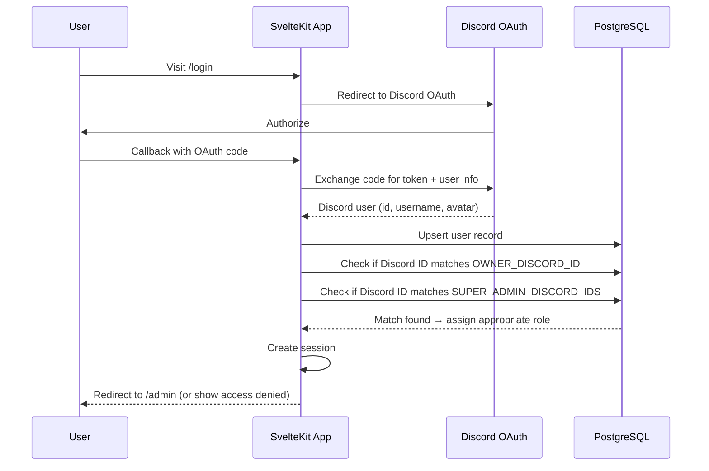

# Authentication & Roles

## Auth Stack

- **Library**: [Better Auth](https://www.better-auth.com/) v1.6+
- **Provider**: Discord OAuth
- **Session**: Server-side sessions managed by Better Auth

## Auth Flow



## Better Auth Setup

The auth instance is configured in [`src/lib/server/auth.ts`](src/lib/server/auth.ts):

```ts
import { betterAuth } from 'better-auth';
import { drizzleAdapter } from 'better-auth/adapters/drizzle';
import { db } from '$lib/server/db';

export const auth = betterAuth({
    database: drizzleAdapter(db, {
        provider: 'pg',
        // Better Auth manages its own tables: user, session, account, verification
    }),
    socialProviders: {
        discord: {
            clientId: env.DISCORD_CLIENT_ID,
            clientSecret: env.DISCORD_CLIENT_SECRET,
        },
    },
});
```

SvelteKit integration in [`src/hooks.server.ts`](src/hooks.server.ts) handles the `/api/auth/*` routes via `svelteKitHandler`.

## Owner Bootstrap

On first login, the app compares the user's Discord ID against the `OWNER_DISCORD_ID` environment variable:

1. A `membership` record is created (or confirmed) with role `owner` for the current site
2. The env var acts as a bootstrap — once the owner exists in the DB, the env var could be removed
3. Long-term, owners can add other admins/editors through the admin panel

```ts
// Pseudocode for owner bootstrap logic
if (user.discordId === env.OWNER_DISCORD_ID) {
    // Upsert membership with role 'owner' for current site
    await db.insert(memberships).values({
        siteId: locals.site.id,
        userId: user.id,
        role: 'owner',
    }).onConflictDoUpdate({ target: [memberships.siteId, memberships.userId], set: { role: 'owner' } });
}
```

## Super Admin Access

The app checks the user's Discord ID against `SUPER_ADMIN_DISCORD_IDS` (comma-separated):

1. Matched users get cross-site admin access — bypass site-scoped membership checks
2. Super admins can access any site's admin panel regardless of `OWNER_DISCORD_ID`
3. Intended for David (system maintainer) to manage all sites
4. Checked on every request, not just at login

```ts
const SUPER_ADMIN_IDS = (env.SUPER_ADMIN_DISCORD_IDS || '').split(',').map(id => id.trim());
const isSuperAdmin = SUPER_ADMIN_IDS.includes(user.discordId);
```

## Role Hierarchy

| Role | Permissions | Assigned By |
|------|-------------|-------------|
| `owner` | Full control. Can manage admins. One per site initially. | Bootstrap via `OWNER_DISCORD_ID` |
| `admin` | Can edit all site settings and content. Cannot delete site or manage owner. | Owner |
| `editor` | Can edit content (events, pages) but not site settings or branding. | Owner or Admin |

### Checking Roles in Server Code

```ts
import { redirect } from '@sveltejs/kit';

// Auth guard — redirect if not logged in
if (!locals.user) {
    redirect(302, '/login');
}

// Role guard — check minimum role
const roleHierarchy = { owner: 3, admin: 2, editor: 1 };
const userRole = locals.membership?.role;
const minRole = 'admin';

if (!userRole || (roleHierarchy[userRole] ?? 0) < (roleHierarchy[minRole] ?? 0)) {
    // Check super admin bypass
    if (!locals.isSuperAdmin) {
        redirect(302, '/admin'); // or show 403
    }
}
```

### In Admin Layout Server Load

```ts
// src/routes/admin/+layout.server.ts
import { redirect } from '@sveltejs/kit';
import type { LayoutServerLoad } from './$types';

export const load: LayoutServerLoad = async ({ locals }) => {
    if (!locals.user) {
        redirect(302, '/login');
    }

    return {
        user: locals.user,
        membership: locals.membership,
        isSuperAdmin: locals.isSuperAdmin,
    };
};
```

### In Page Components

```svelte
<script lang="ts">
    let { data } = $props();
    const { user, membership } = data;
    const canEdit = $derived(membership?.role === 'owner' || membership?.role === 'admin');
</script>

{#if canEdit}
    <button onclick={handleSave}>Save Changes</button>
{/if}
```

## Session Handling

Better Auth manages sessions automatically. Key patterns:

- **Check login status**: `locals.user` is set by the auth handler in the hooks
- **Logout**: POST to `/api/auth/signout`
- **Session persistence**: Better Auth uses cookies; no client-side token storage needed
- **No client-side auth state**: Auth state comes from server load functions, never from `$page.data` derived values on the client (use server load functions exclusively)
