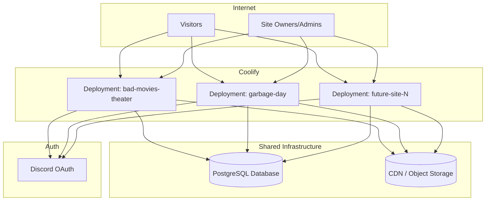
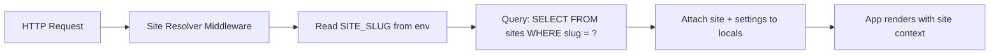
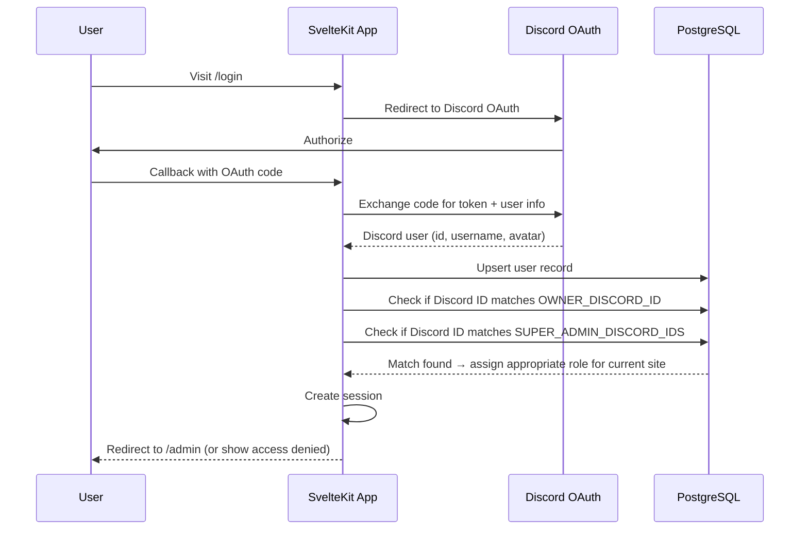

# Technical Architecture Plan

## Stack Summary

| Layer | Choice | Notes |
|-------|--------|-------|
| Framework | SvelteKit | File-based routing, server-side rendering, API routes |
| Language | TypeScript | Strict mode recommended |
| Database | PostgreSQL | Single shared instance for all sites |
| ORM | Drizzle ORM | Type-safe, lightweight, SQL-first |
| Auth | Better Auth | With Discord OAuth provider |
| Deployment | Coolify | Multiple deployments from one Git repo |
| CDN/Storage | Bunny CDN or S3-compatible | Single bucket, site-scoped paths |
| Containerization | Docker | Dockerfile in repo, built by Coolify |

## Architecture Overview



Each Coolify deployment runs the same Docker image from the same Git repo. The only difference between deployments is their environment variables — specifically `SITE_SLUG`.

## Site Resolution Flow

Every request follows this path:



1. Request hits the SvelteKit server
2. A hook or middleware reads `SITE_SLUG` from environment variables
3. The site record (and its settings) is loaded from the database
4. Site context is attached to `locals` for the lifetime of the request
5. All downstream code (pages, API routes, auth checks) uses this site context

## Data Scoping Rule

**Every site-owned record MUST include a `siteId` column.**

This applies to: settings, pages, events, assets, nav links, social links, memberships, and any future content types.

Queries always filter by `siteId`:

```sql
SELECT * FROM events WHERE siteId = $currentSiteId ORDER BY startTime ASC;
```

This rule means:
- No cross-site data leaks
- The database is logically multi-tenant
- Migrating to a single-deployment/multi-domain model later requires no schema changes

## Directory Structure (Proposed)

```text
/
├── src/
│   ├── app.d.ts              # App types, locals augmentation
│   ├── app.html              # HTML shell
│   ├── hooks.server.ts       # Site resolver, auth handling
│   ├── lib/
│   │   ├── server/
│   │   │   ├── db/
│   │   │   │   ├── index.ts          # Drizzle + postgres connection
│   │   │   │   ├── schema.ts         # All table definitions
│   │   │   │   └── seed.ts           # Optional seed data
│   │   │   ├── auth.ts               # Better Auth configuration
│   │   │   ├── site-resolver.ts      # Site loading by SITE_SLUG
│   │   │   └── cdn.ts                # CDN URL helpers
│   │   └── shared/
│   │       └── types.ts              # Shared TypeScript types
│   ├── routes/
│   │   ├── +layout.server.ts         # Root layout, loads site for all pages
│   │   ├── +page.server.ts           # Public homepage data loading
│   │   ├── +page.svelte              # Public homepage
│   │   ├── login/
│   │   │   └── +page.svelte          # Login page (Discord redirect)
│   │   ├── admin/
│   │   │   ├── +layout.server.ts     # Admin auth guard
│   │   │   ├── +layout.svelte        # Admin shell/nav
│   │   │   ├── +page.svelte          # Admin dashboard
│   │   │   ├── settings/
│   │   │   │   └── +page.svelte      # Site settings editor
│   │   │   ├── branding/
│   │   │   │   └── +page.svelte      # Logo, colors, theme
│   │   │   ├── homepage/
│   │   │   │   └── +page.svelte      # Homepage content editor
│   │   │   ├── links/
│   │   │   │   └── +page.svelte      # Nav and social links
│   │   │   └── events/
│   │   │       └── +page.svelte      # Events manager
│   │   └── api/
│   │       └── auth/
│   │           └── [...betterAuth]    # Better Auth API routes
│   └── styles/
│       └── app.css                   # Global styles, CSS custom properties
├── static/
│   └── favicon.png
├── Dockerfile
├── docker-compose.yml                # Optional, for local dev
├── drizzle.config.ts
├── package.json
├── svelte.config.js
├── tsconfig.json
└── vite.config.ts
```

## Auth Flow



### Ownership Bootstrap

On first login, the app compares the user's Discord ID against the `OWNER_DISCORD_ID` environment variable. If they match:
1. A membership record is created (or confirmed) with role `owner` for the current site
2. The env var acts as a bootstrap — once the owner exists in the database, the env var could theoretically be removed (though keeping it is fine)

Long-term, existing owners can add other admins/editors through the admin panel, and the database becomes the source of truth for all roles.

### Super Admin Access

The app also checks the user's Discord ID against `SUPER_ADMIN_DISCORD_IDS` (a comma-separated list). If a match is found:
1. The user is granted cross-site admin access — they bypass site-scoped membership checks
2. Super admins can access any site's admin panel regardless of `OWNER_DISCORD_ID`
3. This is intended for David (system maintainer) to manage all sites
4. Super admin access is checked on every request, not just at login

## Deployment Model

### Current: Multiple Coolify Deployments

```
Git Repo (main branch)
    │
    ├── Coolify Deployment "bad-movies-theater"
    │   └── Env: SITE_SLUG=bad-movies-theater
    │
    ├── Coolify Deployment "garbage-day"
    │   └── Env: SITE_SLUG=garbage-day
    │
    └── Coolify Deployment "future-site"
        └── Env: SITE_SLUG=future-site
```

Each deployment:
- Points to the same Git repo + branch
- Has its own set of environment variables
- Connects to the same database
- Uses the same CDN bucket
- Is completely isolated at the container level

### Future: Single Deployment / Multi-Domain (Optional)

If desired later, the system could switch to a single deployment that resolves the site by domain name instead of `SITE_SLUG`:
- Add a `domains` table or JSON field on `sites`
- The site resolver checks the request's `Host` header
- Falls back to `SITE_SLUG` for local dev

This is **not** needed for version 1 but the architecture supports it because all data is already scoped by `siteId`.

## CDN/Asset Architecture

```
CDN Bucket: collective-hub
├── sites/
│   ├── bad-movies-theater/
│   │   ├── logo.webp
│   │   ├── background.webp
│   │   └── events/
│   │       └── movie-night-june.webp
│   ├── garbage-day/
│   │   ├── logo.webp
│   │   └── background.webp
│   └── future-site/
│       └── logo.webp
```

Key rules:
- Database stores asset records with `cdnKey` (the path within the bucket)
- Application constructs full CDN URLs using `CDN_BASE_URL` + `cdnKey`
- Never hardcode full CDN URLs in the database
- Assets are always scoped by `siteId` in the database
- Path convention: `sites/{siteSlug}/{type}/{filename}`
- All uploaded images are automatically converted to webp and optimized before storage

## Migration Safety

Multiple deployments sharing one database means migrations must be handled carefully:

- **Migrations run automatically on startup**, but only on the deployment with `RUN_MIGRATIONS=true`.
- All other deployments (`RUN_MIGRATIONS=false`) skip migrations entirely.
- **Exactly one deployment** must be designated the migration runner. Choose a stable, low-traffic deployment.
- The migration runner must be deployed first when schema changes are included in a release.
- Drizzle's migration tools handle idempotency — running the same migration twice is safe, but concurrent runs from multiple deployments must be avoided.
- This is enforced by convention (the `RUN_MIGRATIONS` flag), not by a distributed lock. David must ensure only one deployment has the flag set to `true`.

## Key Architecture Decisions

| Decision | Choice | Rationale |
|----------|--------|-----------|
| Multi-deploy vs single-deploy | Multi-deploy first | Simpler initially, no domain-routing complexity |
| siteId on every table | Yes | Multi-tenant from day one, no rewrite needed later |
| JSON vs normalized tables | Prefer normalized; JSON for theme settings only | Queryable, type-safe, referential integrity |
| CDN URLs in DB | Store keys only, not full URLs | CDN migration is trivial, no data changes needed |
| Image processing | Auto webp conversion + optimization on upload | Consistent format, smaller files, better performance |
| Auth library | Better Auth | First-class Discord support, SvelteKit integration |
| Super admin | `SUPER_ADMIN_DISCORD_IDS` env var | Cross-site access for system maintainer |
| Migration strategy | Automated, gated by `RUN_MIGRATIONS` flag | One deployment runs them; others skip |
| ORM | Drizzle | Type-safe, lightweight, good Postgres support |
