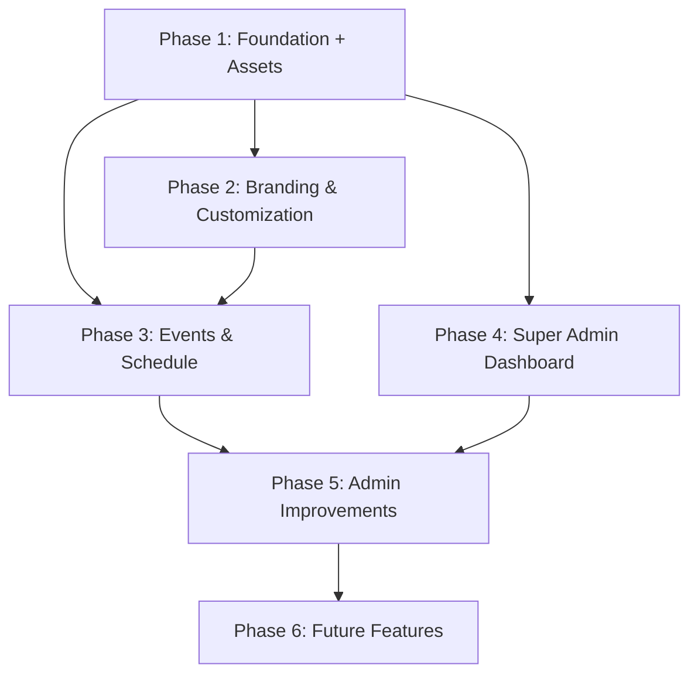

# Feature Roadmap

## How to Read This

Each phase builds on the previous one. Phases are ordered by dependency, not by importance.

**The rule:** Phase 1 must be complete and working before starting Phase 2. Later phases can be reordered based on need.

---

## Phase 1: Foundation  Minimum Viable Product

**Goal:** A working SvelteKit app that resolves a site by `SITE_SLUG`, shows a public homepage, lets the owner log in and edit settings, and supports image uploads with CDN storage.

### Deliverables

- [x] SvelteKit project initialized with TypeScript
- [x] Drizzle ORM configured, connected to Postgres
- [x] Core database tables created: `sites`, `users`, `memberships`, `siteSettings`, `assets`
- [x] Better Auth integrated with Discord OAuth provider
- [x] Site resolver: reads `SITE_SLUG`, loads site + settings from DB, attaches to `locals`
- [x] Public homepage renders with site name and basic content
- [x] Login page: "Login with Discord" button
- [x] Owner bootstrap: `OWNER_DISCORD_ID` env var creates owner membership on first login
- [x] Super admin bootstrap: `SUPER_ADMIN_DISCORD_IDS` env var grants cross-site access
- [x] Admin auth guard: `/admin/*` routes redirect unauthenticated users to login
- [x] Basic admin dashboard page (placeholder with site name)
- [x] Admin settings page: edit site name and tagline (saved to `siteSettings` JSON)
- [x] CDN storage integration (Bunny CDN or S3-compatible)
- [x] Image upload endpoint with webp conversion and optimization
- [x] File validation: accepted types, max size
- [x] Asset records created in database on upload
- [x] Asset library page in admin: browse, search, copy CDN URL
- [x] Migration automation: primary deployment runs migrations on startup; others skip via `RUN_MIGRATIONS` env var

### What's NOT in Phase 1
- No branding customization (logo, colors) — Phase 2
- No homepage content editing beyond name/tagline — Phase 2
- No events, nav links, social links — Phase 2 / Phase 4
- No role management UI — Phase 5
- No super admin dashboard UI — Phase 5

---

## Phase 2: Branding & Customization

**Goal:** Site owners can customize the look and feel of their site. The public site reflects branding settings. Asset upload is already available from Phase 1.

### Deliverables

- [x] Admin branding page: select logo, background image, favicon from asset library
- [x] Admin theme page: preset selector (dark/light/custom), accent color, background color, text color
- [x] CSS custom properties generated from theme settings
- [x] Admin homepage editor: hero title, subtitle, about text, CTA button text/link
- [x] Public site renders all branding and homepage settings
- [x] Admin nav links manager: add, edit, reorder, delete header/footer links
- [x] Admin social links manager: add, edit, reorder, delete social platform links
- [x] Public site renders nav links and social links
- [x] Layout preset support (single configurable layout for V1)

### What's NOT in Phase 2
- Multiple layout options (just one flexible layout)
- Custom CSS fields
- Per-page theming
- Theme marketplace or sharing

---

## Phase 3: Events & Schedule

**Goal:** Sites can display upcoming events. Admins can manage events through the admin panel.

### Deliverables

- [x] Events table created (if not already)
- [x] Admin events manager: create, edit, delete, publish/unpublish events
- [x] Event fields: title, description, type, start time, end time, timezone, location, external link, image
- [x] Public homepage: "Next Event" card (shows the next upcoming published event)
- [x] Public homepage: "Upcoming Events" list/schedule section
- [x] Event detail page (optional — can be a modal or external link for V1)
- [x] Timezone display handling (show event time in visitor's local time via JS)

### What's NOT in Phase 3
- Recurring/repeating events
- Calendar feed (iCal/RSS)
- Event reminders or notifications
- Attendee RSVPs
- Integration with Discord events

---

## Phase 4: Super Admin Dashboard

**Goal:** David (system maintainer) can manage all sites from a central dashboard.

### Deliverables

- [x] Super admin auth: `SUPER_ADMIN_DISCORD_IDS` env var bypasses site-scoped membership checks
- [x] Super admin dashboard: list all sites with status, quick links
- [x] Create new site flow: insert site row, generate setup instructions
- [x] View any site's settings, events, assets (read-only cross-site access)
- [x] Feature flag management across sites
- [x] Site deactivation/reactivation

### What's NOT in Phase 4
- Full site provisioning automation (still manual Coolify setup)
- Usage analytics or billing
- Impersonation (login as site owner)

---

## Phase 5: Admin Improvements

**Goal:** Better admin experience, role management, and operational tooling.

### Deliverables

- [x] Role management: owner can add/remove admins and editors
- [x] Admin list page showing all team members with roles
- [x] Preview mode: admins can preview unpublished changes
- [x] Improved admin dashboard with quick stats
- [x] Site cloning helper (manual or scripted) for creating new sites
- [x] Feature flags via settings JSON or env vars
- [x] Audit-like log of who changed what (basic)
- [x] Enhanced super admin dashboard: cross-site search, bulk operations

### What's NOT in Phase 5
- Full audit trail with rollback
- Granular permission system
- Multi-owner support per site

---

## Phase 6: Future (Optional, Not Planned in Detail)

These are ideas for later. Do not build any of these until Phases 1-5 are solid.

- **Community features:** reviews, comments, discussion posts
- **Discord integration:** server widget, event sync, role sync
- **Calendar feeds:** iCal export, Google Calendar integration
- **AI tools:** content suggestions, event descriptions, semantic search (pgvector)
- **Advanced theming:** multiple layout presets, custom CSS per site
- **Analytics:** page views, event clicks, simple dashboard
- **Email notifications:** event reminders, new content alerts
- **Single-deployment model:** switch from multi-Coolify-deployment to one deployment resolving sites by domain
- **Public API:** read-only API for events and site info

---

## Phase Dependency Diagram

**Note:** Phase 1 now includes CDN + asset upload (previously Phase 3). Phase 4 (Super Admin Dashboard) can start as soon as Phase 1 is done — it's independent of branding and events. Phase 5 enhances both regular admin and super admin experiences.
