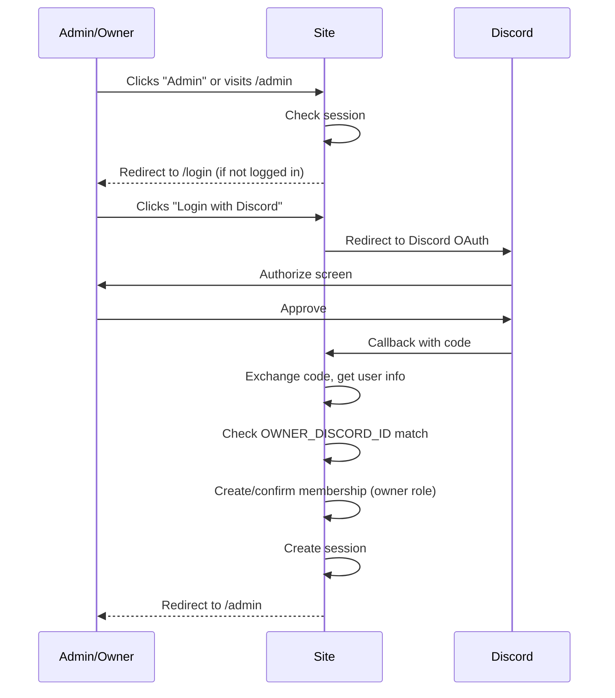

# Admin UX Planning Document — The Collective Hub

## Design Principles

- **Practical over fancy.** A basic form that works beats a beautiful UI that's confusing.
- **One page per concern.** Settings, branding, homepage, links, events, assets — each gets its own admin page.
- **Instant feedback.** Save button with clear success/error state. No ambiguous "it might have saved" experiences.
- **Site-scoped by default, super admin cross-site.** Regular admins see only their site. Super admins (David) can access any site's admin panel.
- **Mobile-accessible but desktop-first.** Admins will primarily manage their site from a desktop/laptop.

---

## Login Flow



### Login Page

A simple, centered page with:
- Site logo (or site name if no logo set)
- "Login with Discord" button (prominent, branded)
- Brief explanation: "Sign in to manage [Site Name]"
- No other login methods in V1

### First Owner Login

1. Owner visits `/login`
2. Logs in with Discord
3. System detects their Discord ID matches `OWNER_DISCORD_ID`
4. Owner membership created automatically
5. Redirected to admin dashboard
6. Dashboard shows: "Welcome, [username]. You are the owner of [Site Name]."

### Super Admin Login

Super admins (Discord IDs listed in `SUPER_ADMIN_DISCORD_IDS`):
- Can log in to any site's admin panel regardless of `OWNER_DISCORD_ID`
- See a "Super Admin" badge or indicator in the admin UI
- Have a "View All Sites" link (placeholdered until Phase 4 super admin dashboard)
- Can perform all actions a site owner can

### Non-Owner Login (Before Role Management)

If a non-owner, non-super-admin logs in (Phase 1-4 before role management exists):
- They are authenticated but have no membership for the current site
- Show: "You don't have access to manage this site. Contact the site owner."
- No admin pages are accessible

### Session Behavior

- Session persists across browser restarts (HTTP-only cookie via Better Auth)
- Logout button in admin nav clears session
- Session expiry: Better Auth defaults (configurable)

---

## Admin Layout

```
┌──────────────────────────────────────────────┐
│  [Logo/Name]  Admin Panel        [User] [Logout] │
├──────────┬───────────────────────────────────┤
│          │                                   │
│ Dashboard│                                   │
│ Settings │        Content Area               │
│ Branding │                                   │
│ Homepage │                                   │
│ Links    │                                   │
│ Events   │                                   │
│ Assets   │                                   │
│ Team     │                                   │
│          │                                   │
└──────────┴───────────────────────────────────┘
```

- **Left sidebar:** Navigation links. Highlight current page. Collapse on mobile (hamburger).
- **Top bar:** Site name, current user avatar + name, logout button.
- **Content area:** The active page content.

---

## Admin Pages

### Dashboard (`/admin`)

**Purpose:** Quick overview and navigation hub.

**Content:**
- Welcome message with owner name
- Site status: "Your site is live at [URL]"
- Quick stats (future): event count, page views
- Quick links to common actions: "Edit Homepage", "Manage Events"
- In V1, this can be minimal—a simple landing page after login

### Settings (`/admin/settings`)

**Purpose:** Basic site identity.

**Fields:**
- Site name (text input)
- Tagline (text input)
- Save button

**Behavior:**
- Load current values from `siteSettings` JSON
- Save updates the JSON blob
- Success toast: "Settings saved"
- Error toast with specific message on failure

### Branding (`/admin/branding`)

**Purpose:** Visual identity and theme.

**Fields:**
- Logo: file upload button OR manual URL input (Phase 2: asset picker from library)
- Background image: same pattern
- Favicon: file upload
- Theme preset: dropdown (Dark, Light, Custom)
- Accent color: color picker + hex input
- Background color: color picker + hex input
- Text color: color picker + hex input

**Behavior:**
- Color pickers show live preview of the color
- "Preview" link opens public site in new tab
- Save updates `siteSettings.branding` and `siteSettings.theme` in JSON

### Homepage (`/admin/homepage`)

**Purpose:** Edit public homepage content.

**Fields:**
- Hero title (text input)
- Hero subtitle (text input)
- About/intro text (textarea, plain text or basic Markdown)
- Primary button text (text input, e.g., "Join Discord")
- Primary button link (URL input)
- Toggle: Show next event section (checkbox)
- Toggle: Show schedule section (checkbox)

**Behavior:**
- All fields are optional — empty fields are hidden on the public site
- Save updates `siteSettings.homepage` in JSON
- "View site" link opens public homepage in new tab

### Links (`/admin/links`)

**Purpose:** Manage navigation and social links.

**Sub-pages or tabs:**
- **Nav Links tab:** Table of links with label, URL, position (header/footer), sort order
- **Social Links tab:** Table of links with platform (dropdown: Discord, Twitter/X, YouTube, Twitch, etc.), label, URL, sort order

**Behavior:**
- Add new link: inline form at top or modal
- Edit: inline or modal
- Delete: with confirmation
- Drag-to-reorder (nice-to-have, manual sort order numbers are fine for V1)
- Save is per-link or "Save all changes" button

### Events (`/admin/events`)

**Purpose:** Manage event listings.

**List view:**
- Table: title, date/time, status (published/draft), actions (edit/delete)
- "Add Event" button
- Filter: upcoming, past, drafts

**Event edit/create form:**
- Title (text, required)
- Description (textarea)
- Event type (dropdown: Screening, Watch Party, Meetup, Other)
- Start time (datetime picker)
- End time (datetime picker, optional)
- Timezone (dropdown, defaults to `America/New_York`)
- Location (text, e.g., "Discord Stage")
- External link (URL)
- Event image (upload or URL)
- Published toggle

**Behavior:**
- Events sorted by start time
- Draft events hidden from public site
- Delete with confirmation
- Basic validation: title required, start time required

### Assets (`/admin/assets`)

**Purpose:** Browse and manage uploaded files.

**List view:**
- Grid or table of assets with thumbnail, filename, type, size, date
- Search/filter by filename
- Click to copy CDN URL
- Delete with confirmation

**Upload:**
- Drag-and-drop zone or file input
- Accept: image/webp, image/png, image/jpeg
- Max size: configurable (e.g., 5MB)
- Progress indicator during upload
- Success: asset appears in list

**Note:** Asset upload with webp conversion is available from Phase 1. The asset library is fully functional from day one — no manual URL phase.

### Team (`/admin/team`) — Phase 5+

**Purpose:** Manage admins and editors.

**List view:**
- Table: user avatar, username, role, actions (change role, remove)

**Add member:**
- Input for Discord username or ID
- Role dropdown
- "Add" button

**Behavior:**
- Owner cannot be removed or demoted
- Owner can promote/demote/remove admins and editors
- Changes take effect immediately

---

## Error States & Edge Cases

| Situation | Behavior |
|-----------|----------|
| Save fails (network error) | Show error toast, keep form data intact |
| Save fails (validation) | Highlight invalid fields, show specific messages |
| Session expires while editing | Redirect to login on next action, preserve intended destination |
| Concurrent editing (two admins) | Last write wins in V1 (no conflict detection) |
| Loading state | Skeleton/spinner while data loads |
| Empty state | "No events yet. Create your first event!" with action button |
| CDN unreachable | Admin still works; image uploads fail with clear error |

---

## What to Avoid

- **Multi-step wizards.** Single-page forms are simpler.
- **Inline editing everywhere.** Form pages with clear save buttons are more predictable.
- **Real-time preview in V1.** A "preview" link to the public site is sufficient.
- **Over-designed dashboards.** The admin panel is a tool, not a product demo.
- **Custom permission UIs in V1.** Owner + super admin access is sufficient until Phase 5.
