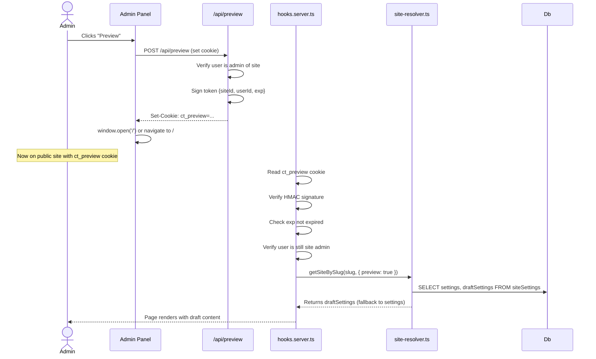

# Preview Mode Architecture — Phase 5 Design

**Status:** ✅ Implemented
**Phase:** 5 — Preview Mode (Basic)
**Created:** 2026-06-06
**Implemented:** 2026-06-06

---

## 1. Overview

The Collective Hub is a SvelteKit multi-tenant application where every admin form action (branding, homepage, settings, events) writes directly to the live site. Phase 5 introduces a **draft/preview/publish** workflow so admins can stage changes privately, preview them on the public site, then publish them atomically — all without disrupting visitors.

### Scope (Phase 5)

| In Scope | Out of Scope (deferred) |
|----------|------------------------|
| Draft/publish for `siteSettings` JSON (branding, theme, homepage, feature flags) | Draft for individual nav/social links |
| Preview cookie/token authentication | Draft for assets |
| "Save Draft" / "Publish" / "Discard Drafts" actions | Revision history / audit log |
| Preview mode shows unpublished events | Scheduled publishing |
| Preview available to authenticated admins/owners/super admins only | Multi-user conflict resolution (optimistic locking) |

---

## 2. Schema Changes

### Decision: Add `draftSettings` Column (Not a Separate Table)

A separate `site_settings_drafts` table was considered but rejected. The single-column approach is simpler because:

- Every admin page already reads/writes to the single `site_settings.settings` column — adding one more column is the smallest diff.
- Drizzle's `onConflictDoUpdate` upsert pattern stays unchanged (one row per site).
- No joins needed when loading — a single row fetch gets both live and draft settings.
- The draft either exists (`NOT NULL`) or doesn't (`NULL`) — easy to check.

### Migration

**File:** `drizzle/0003_*.sql` (auto-generated by `drizzle-kit generate`)

```sql
ALTER TABLE "site_settings" ADD COLUMN "draft_settings" jsonb;
COMMENT ON COLUMN "site_settings"."draft_settings" IS 'Staged settings pending publish. NULL means no drafts exist.';
```

### Schema Code Change

**File:** [`src/lib/server/db/schema.ts`](src/lib/server/db/schema.ts:88–106)

Add one line to the `siteSettings` table definition:

```typescript
draftSettings: jsonb('draft_settings'),  // nullable — null means no pending drafts
```

The `settings` column retains its role as the single source of published truth. `draftSettings` is the staging area.

### Column Semantics

| `draftSettings` value | Meaning |
|----------------------|---------|
| `NULL` | No drafts exist. All changes have been published. |
| `{ ... }` (jsonb object) | Draft exists. Preview mode shows this. Live site ignores it. |

When a publish action runs: `settings ← draftSettings`, then `draftSettings ← NULL`.

---

## 3. Preview Token / Cookie Mechanism

### Design Rationale

The preview cookie solves a specific problem: the public site always loads from `SITE_SLUG`, but we need to serve draft content only when an authorized admin requests it. A signed cookie tells the server "this is a preview request from an admin of this site."

| Approach | Why chosen / rejected |
|----------|----------------------|
| Query parameter (`?preview=token`) | Leaks token in URLs, bookmarks, shared links. Rejected. |
| Separate preview subdomain | Requires DNS/config per site. Too complex for Phase 5. |
| Cookie with HMAC-signed token | Self-contained, httpOnly, per-site scoped, no infrastructure changes. **Chosen.** |

### Token Format

Not JWT — a simple HMAC-signed payload avoids adding a dependency. The token is a base64-encoded JSON payload with a SHA-256 signature appended.

```
token = base64url(payload) + "." + base64url(HMAC-SHA256(payload, secret))
```

**Payload:**

```typescript
interface PreviewTokenPayload {
  siteId: string;    // UUID of the site being previewed
  userId: string;    // UUID of the admin who requested preview
  exp: number;       // Unix timestamp when the token expires (now + 24h)
}
```

### Cookie Specification

| Attribute | Value |
|-----------|-------|
| Name | `ct_preview` |
| Value | The signed token string |
| httpOnly | `true` (inaccessible to client JS) |
| sameSite | `Lax` (allows navigation from admin to public site) |
| path | `/` |
| maxAge | 86400 (24 hours, matching `exp`) |
| secure | `true` in production |

### Secret Key

Use a dedicated `PREVIEW_SECRET` env var. If unset, fall back to `AUTH_SECRET` (Better Auth's secret). Either way, the secret is available server-side only.

### Token Lifecycle



### Authorization Rules

The preview token/cookie is valid only if **all** of these hold:

1. The HMAC signature verifies (tamper-proof).
2. The `exp` timestamp is in the future.
3. The `siteId` in the token matches `event.locals.site.id`.
4. The `userId` in the token belongs to a user who is still authenticated **and** is either:
   - A super admin (`event.locals.isSuperAdmin`), OR
   - A member of the site with role `owner`, `admin`, or `editor`.

If any check fails, the cookie is ignored and the live published settings are served (no error, no redirect — the admin just sees the live site).

---

## 4. Save → Draft → Publish Workflow

### Form Action Design

Each admin form that modifies `siteSettings` gains **named form actions** instead of a single `default` action. The three new actions are:

| Action | Named route | Behavior |
|--------|------------|----------|
| `saveDraft` | `?/saveDraft` | Writes form data into `draftSettings`. Does NOT touch `settings`. |
| `publish` | `?/publish` | Writes form data into `settings`, clears `draftSettings` to NULL. |
| `discardDrafts` | `?/discardDrafts` | Sets `draftSettings` to NULL. Leaves `settings` unchanged. |

**Backward compatibility:** If a form only has one submit button (no named action), the `default` action behaves as `publish` — writing directly to `settings` and clearing any drafts. This preserves existing behavior for simple cases.

### Save-to-Draft (Detailed)

When an admin clicks "Save Draft" on the branding page:

1. Form POSTs to `/admin/branding?/saveDraft` with all form fields.
2. The `saveDraft` action reads the current **published** `settings` from the database (not the current draft).
3. Merges form fields into the settings JSON (same merge logic as today).
4. Writes the merged result to `draftSettings`.
5. Leaves `settings` untouched — live site is unchanged.
6. Returns `{ success: true, draftSaved: true }`.

Key insight: **always merge against published settings, not drafts.** This prevents accumulated cruft if an admin saves draft multiple times without publishing. Each save-to-draft starts fresh from the live truth.

### Publish (Detailed)

When an admin clicks "Publish":

1. Form POSTs to `/admin/branding?/publish` with all form fields.
2. The `publish` action reads the current **published** `settings`.
3. Merges form fields into settings (same merge logic).
4. Writes merged result to `settings` (the published column).
5. Sets `draftSettings` to NULL (clears any prior drafts).
6. Returns `{ success: true, published: true }`.

If the admin had prior drafts that weren't incorporated into this publish (because they were editing a different section), those drafts are discarded on publish. This is intentional for Phase 5 — publish means "push everything live and clear all drafts."

### Discard Drafts (Detailed)

1. Form POSTs to `/admin/branding?/discardDrafts` (no form fields needed).
2. Sets `draftSettings` to NULL for the site.
3. Returns `{ success: true, draftsDiscarded: true }`.

No data migration or conflict resolution needed — just a simple UPDATE.

### Events: Leveraging Existing `isPublished`

Events already have [`isPublished`](src/lib/server/db/schema.ts:206). No schema change needed. The workflow is:

- **Public site (live mode):** Only events with `isPublished = true` appear.
- **Public site (preview mode):** All events appear regardless of `isPublished`, sorted by `startTime`. Unpublished events render with a visual "draft" indicator.
- **Admin events page:** Always shows all events. The toggle-publish action already exists.

The public homepage loader at [`src/routes/+page.server.ts`](src/routes/+page.server.ts:79–111) currently queries `WHERE isPublished = true`. In preview mode, this filter is removed.

### What About Links (navLinks / socialLinks)?

Links operate on separate tables ([`navLinks`](src/lib/server/db/schema.ts:140–161), [`socialLinks`](src/lib/server/db/schema.ts:165–186)) and don't go through the `siteSettings` JSON. For Phase 5, links remain **immediately live** — no draft mechanism. The rationale:

- Links are simple CRUD items (add/edit/delete), not a complex configuration blob.
- Adding draft columns to link tables would require draft-aware queries everywhere links are shown.
- The roadmap explicitly says "basic" preview — scoping to `siteSettings` + events is the right balance.

If future phases need draft links, the pattern established here (draft column + preview cookie) extends naturally.

---

## 5. Conflict / Merge Strategy

### Problem Statement

What happens if Admin A saves a draft (branding changes), and Admin B publishes (homepage changes) before Admin A publishes?

### Phase 5 Approach: Last-Write-Wins with Draft-on-Publish Discard

This is intentionally simple:

1. **Drafts are per-site, not per-user.** There is one `draftSettings` column per site. If Admin A saves a draft (branding changes) and Admin B saves a draft (homepage changes), Admin B's draft overwrites Admin A's.
2. **On publish, all drafts are cleared.** Publishing means "take what's in the form right now, write it to live, and discard any other drafts." Admins on a small team coordinate informally.
3. **No optimistic locking or version columns.** Phase 5 trusts that admin teams for a single site are small (1–3 people) and concurrent editing is rare.

### Future Improvement Path (Not Phase 5)

- Per-section drafts: `draftSettings` could store only the sections being edited, with a merge-on-publish strategy.
- `updatedAt` comparison: before writing, check that the row hasn't changed since read.
- Draft ownership: add `draftUpdatedBy` (userId) and `draftUpdatedAt` columns for multi-user awareness.

---

## 6. File-by-File Change List

### 6.1 New Files

#### `src/lib/server/preview.ts` — Token Signing & Verification

```
Purpose: Sign and verify preview tokens using HMAC-SHA256.
Exports:
  - signPreviewToken(payload: PreviewTokenPayload, secret: string): string
  - verifyPreviewToken(token: string, secret: string): PreviewTokenPayload | null
  - getPreviewSecret(): string  // reads PREVIEW_SECRET or falls back to AUTH_SECRET
```

The signing function:
1. JSON-serializes the payload.
2. Computes `HMAC-SHA256(payload, secret)`.
3. Returns `base64url(payload) + "." + base64url(signature)`.

The verify function reverses this and checks the signature. Returns `null` if signature is invalid or `exp` is in the past.

#### `src/routes/api/preview/+server.ts` — Preview Cookie API Endpoint

```
Purpose: Set or clear the ct_preview cookie. Called by the admin UI.
Handles:
  - POST { action: 'enable' }  → sets ct_preview cookie, returns { success: true }
  - POST { action: 'disable' } → clears ct_preview cookie, returns { success: true }

Authorization:
  - Must be authenticated (event.locals.user exists)
  - Must be super admin OR site member with role owner/admin/editor
  - If action is 'enable', verifies site has draftSettings (drafts exist to preview)
```

### 6.2 Modified Files

#### [`src/lib/shared/types.ts`](src/lib/shared/types.ts)

Add:

```typescript
/** Payload embedded in a signed preview cookie token */
export interface PreviewTokenPayload {
  siteId: string;
  userId: string;
  exp: number;  // Unix timestamp (seconds)
}
```

#### [`src/app.d.ts`](src/app.d.ts)

Add to `App.Locals`:

```typescript
previewMode: boolean;  // true if the current request is a valid preview
```

#### [`src/lib/server/db/schema.ts`](src/lib/server/db/schema.ts:88–106)

Add `draftSettings` column to `siteSettings` table definition (see Section 2).

#### [`src/lib/server/site-resolver.ts`](src/lib/server/site-resolver.ts)

**Current signature:**
```typescript
async function getSiteBySlug(slug: string): Promise<SiteContext>
```

**New signature:**
```typescript
async function getSiteBySlug(
  slug: string,
  opts?: { preview?: boolean }
): Promise<SiteContext>
```

When `opts.preview` is `true`:
1. Load the `siteSettings` row as before.
2. If `draftSettings` is not null, use `draftSettings` as the settings object instead of `settings`.
3. If `draftSettings` is null (no drafts exist), fall back to `settings` — previewing live content when there's nothing to preview is harmless.

This keeps the change contained to one function. Every consumer of `siteSettings` upstream doesn't need to know about drafts — they just get the "effective" settings.

#### [`src/hooks.server.ts`](src/hooks.server.ts)

**Add after site resolution (after line 55), before auth delegation:**

```typescript
// --- Preview Mode Detection ---
const previewCookie = event.cookies.get('ct_preview');
let previewMode = false;

if (previewCookie) {
  const secret = getPreviewSecret();
  const payload = verifyPreviewToken(previewCookie, secret);
  
  if (payload) {
    // Token is cryptographically valid and not expired.
    // Now check authorization: is the user still an admin of this site?
    // (Authorization check requires the user/session, which is loaded
    // later in +layout.server.ts. We do a lightweight check here.)
    previewMode = true;  // provisional — refined in +layout.server.ts
  } else {
    // Invalid or expired token — clear the cookie
    event.cookies.delete('ct_preview', { path: '/' });
  }
}

event.locals.previewMode = previewMode;

// Pass preview flag to site resolver
const siteContext = await getSiteBySlug(slug, { preview: previewMode });
event.locals.site = siteContext.site;
event.locals.siteSettings = siteContext.settings;
```

**Important ordering note:** The preview cookie is read *before* the final auth check happens in `+layout.server.ts`. The `previewMode` flag is provisional at this point. The `+layout.server.ts` refines it by verifying the user is still authorized.

Actually, a cleaner approach: the hooks.server.ts sets `previewMode` based on token validity only. Then `+layout.server.ts` (which runs after auth) does the final authorization check and may downgrade `previewMode` to `false` if the user isn't an admin. This avoids coupling hooks to the auth system.

**Revised flow:**

1. `hooks.server.ts`: Verify token signature + expiry → set `event.locals.previewMode = true` tentatively.
2. `+layout.server.ts` (after auth): If `previewMode` is true but user is not an admin → set `event.locals.previewMode = false`, clear the cookie.
3. `site-resolver.ts`: Called from `hooks.server.ts` with `preview: event.locals.previewMode`. At this point the token is valid but the user hasn't been fully authenticated yet. This is acceptable because:
   - If the token is forged, the signature check catches it.
   - If the token is valid but the user session expired, `+layout.server.ts` corrects it.
   - Draft content is only visible for one request before correction.

#### [`src/routes/+layout.server.ts`](src/routes/+layout.server.ts)

**Add preview authorization refinement** (after the existing auth logic, around line 143):

```typescript
// --- Preview Mode Authorization Refinement ---
if (event.locals.previewMode) {
  const isAuthorizedForPreview = 
    isSuperAdmin || 
    (membership && ['owner', 'admin', 'editor'].includes(membership.role));
  
  if (!isAuthorizedForPreview) {
    // User is not authorized to preview — disable preview mode
    event.locals.previewMode = false;
    event.cookies.delete('ct_preview', { path: '/' });
    
    // Re-load site settings without preview (live settings)
    const liveContext = await getSiteBySlug(siteSlug!, { preview: false });
    event.locals.siteSettings = liveContext.settings;
  }
}
```

**Add `previewMode` and `hasDrafts` to the returned data:**

```typescript
return {
  // ... existing returns ...
  previewMode: event.locals.previewMode,
  hasDrafts: /* check if draftSettings is not null for current site */
};
```

#### [`src/routes/+page.server.ts`](src/routes/+page.server.ts)

**Change events query based on preview mode:**

Currently events are filtered with `eq(events.isPublished, true)` (lines 89, 106). When `previewMode` is true, remove this filter so unpublished events appear. The `previewMode` flag comes from `event.locals` (set by hooks + layout).

Add a `previewMode` return prop so the Svelte page can show a "Preview Mode" banner.

#### [`src/routes/admin/+layout.server.ts`](src/routes/admin/+layout.server.ts)

**Add `hasDrafts` check:**

Query the `draftSettings` column for the current site. Return `hasDrafts: boolean` — used by the admin layout to show/hide the Preview and Discard buttons.

```typescript
const [settingsRow] = await db
  .select({ draftSettings: siteSettings.draftSettings })
  .from(siteSettings)
  .where(eq(siteSettings.siteId, site.id))
  .limit(1);

const hasDrafts = settingsRow?.draftSettings != null;
```

Return `hasDrafts` alongside existing data.

#### [`src/routes/admin/+layout.svelte`](src/routes/admin/+layout.svelte)

**Add Preview, Publish, and Discard controls to the top bar** (alongside the existing "Back to Site" and logout button):

| Element | When visible | Behavior |
|---------|-------------|----------|
| "💾 Save Draft" indicator | Always (per-page) | Each admin form page renders its own button |
| "👁️ Preview" button | When `hasDrafts === true` | POSTs to `/api/preview` to set cookie, then opens `/` in new tab |
| "📢 Publish All" button | When `hasDrafts === true` | POSTs to `/api/preview?/publishAll` — copies all drafts to live |
| "🗑️ Discard Drafts" button | When `hasDrafts === true` | POSTs to discard endpoint, clears drafts |

The Preview button emits a POST to `/api/preview` with `{ action: 'enable' }`, gets the `Set-Cookie` response, then does `window.open('/', '_blank')` to view the public site with preview.

#### Admin Form Pages: [`branding`](src/routes/admin/branding/+page.server.ts), [`homepage`](src/routes/admin/homepage/+page.server.ts), [`settings`](src/routes/admin/settings/+page.server.ts), [`super`](src/routes/admin/super/+page.server.ts) (`saveFeatureFlags`)

**Replace the single `default` action with named actions:**

Each form gains:
- `saveDraft` — writes merged form data to `draftSettings`
- `publish` — writes merged form data to `settings`, clears `draftSettings`
- `discardDrafts` — sets `draftSettings` to NULL

**Refactored save logic (shared pattern across all four pages):**

```typescript
async function saveSettings(
  siteId: string,
  formData: FormData,
  target: 'draft' | 'published'
): Promise<void> {
  // 1. Read current PUBLISHED settings (always merge against live truth)
  const [row] = await db
    .select({ settings: siteSettings.settings })
    .from(siteSettings)
    .where(eq(siteSettings.siteId, siteId))
    .limit(1);
  
  const currentSettings = (row?.settings ?? {}) as Record<string, unknown>;
  
  // 2. Build merged settings from form data + currentSettings
  const mergedSettings = buildMergedSettings(formData, currentSettings);
  
  // 3. Write to appropriate column
  if (target === 'draft') {
    await db
      .update(siteSettings)
      .set({ draftSettings: mergedSettings, updatedAt: new Date() })
      .where(eq(siteSettings.siteId, siteId));
  } else {
    await db
      .update(siteSettings)
      .set({ 
        settings: mergedSettings, 
        draftSettings: null,  // clear drafts on publish
        updatedAt: new Date() 
      })
      .where(eq(siteSettings.siteId, siteId));
  }
}
```

**Important refactoring note:** The existing form actions each have their own read-merge-upsert logic. To avoid duplicating the draft/publish split across four files, extract a shared `saveSiteSettings` helper to `$lib/server/settings-writer.ts`. Each page's action becomes a thin wrapper that builds the section-specific merge and calls the helper.

#### [`src/routes/admin/events/+page.server.ts`](src/routes/admin/events/+page.server.ts)

**Load function change:** The admin events page currently loads all events (line 23–26, no `isPublished` filter). This is already correct — admins see everything. No change needed to the load function.

**The preview mode effect on events is in the public homepage** (`+page.server.ts`), not in the admin events page.

### 6.3 New Shared Helper

#### `src/lib/server/settings-writer.ts` (NEW)

```
Purpose: Shared save-to-draft and publish logic used by all admin setting pages.

Exports:
  - saveSiteSettingsDraft(siteId: string, mergedSettings: SiteSettingsData): Promise<void>
  - publishSiteSettings(siteId: string, mergedSettings: SiteSettingsData): Promise<void>
  - discardSiteSettingsDrafts(siteId: string): Promise<void>
```

This eliminates the copy-paste of the upsert pattern across branding, homepage, settings, and super admin pages.

### 6.4 Summary of All File Changes

| File | Change Type | Description |
|------|------------|-------------|
| `src/lib/shared/types.ts` | Modify | Add `PreviewTokenPayload` interface |
| `src/app.d.ts` | Modify | Add `previewMode` to `App.Locals` |
| `src/lib/server/db/schema.ts` | Modify | Add `draftSettings` column to `siteSettings` |
| `src/lib/server/preview.ts` | **New** | Token sign/verify helpers |
| `src/lib/server/settings-writer.ts` | **New** | Shared draft/publish/discard DB operations |
| `src/lib/server/site-resolver.ts` | Modify | Accept optional `preview` param, load draft vs live |
| `src/hooks.server.ts` | Modify | Read `ct_preview` cookie, set `previewMode`, pass to resolver |
| `src/routes/+layout.server.ts` | Modify | Refine preview auth, return `previewMode` + `hasDrafts` |
| `src/routes/+page.server.ts` | Modify | Show unpublished events in preview mode, return `previewMode` |
| `src/routes/+page.svelte` | Modify | Render "Preview Mode" banner when previewing |
| `src/routes/admin/+layout.server.ts` | Modify | Query `hasDrafts`, return to layout |
| `src/routes/admin/+layout.svelte` | Modify | Add Preview / Publish All / Discard buttons |
| `src/routes/admin/branding/+page.server.ts` | Modify | Replace `default` action with `saveDraft`/`publish`/`discardDrafts` |
| `src/routes/admin/branding/+page.svelte` | Modify | Add "Save Draft" button alongside "Publish" |
| `src/routes/admin/homepage/+page.server.ts` | Modify | Same action split as branding |
| `src/routes/admin/homepage/+page.svelte` | Modify | Add "Save Draft" button |
| `src/routes/admin/settings/+page.server.ts` | Modify | Same action split as branding |
| `src/routes/admin/settings/+page.svelte` | Modify | Add "Save Draft" button |
| `src/routes/admin/super/+page.server.ts` | Modify | `saveFeatureFlags` gains draft support |
| `src/routes/admin/super/+page.svelte` | Modify | Feature flag form gains draft/publish |
| `src/routes/api/preview/+server.ts` | **New** | API endpoint to set/clear preview cookie |
| `drizzle/0003_*.sql` | **New** | Migration: add `draft_settings` column |

---

## 7. Migration Plan

### Step 1: Schema Migration

Run `drizzle-kit generate` after adding the `draftSettings` column to the schema definition. This produces `drizzle/0003_*.sql` with:

```sql
ALTER TABLE "site_settings" ADD COLUMN "draft_settings" jsonb;
```

The column is nullable with no default, so existing rows get `NULL` — meaning "no drafts." The application treats `NULL` as the normal state. Zero data migration needed.

### Step 2: Deploy Backend Changes (No UI Yet)

Deploy the schema change, the new `preview.ts` and `settings-writer.ts` helpers, and the modified `site-resolver.ts` and `hooks.server.ts`. At this point:

- `draftSettings` column exists but is always NULL (no code writes to it yet).
- `hooks.server.ts` checks for `ct_preview` cookie but no code sets it yet.
- All existing form actions still work — they write to `settings` as before.
- **No user-visible change.**

### Step 3: Deploy Form Action Changes

Update `branding`, `homepage`, `settings`, and `super` page servers to use the new `saveDraft`/`publish`/`discardDrafts` actions. Update the corresponding Svelte pages to have "Save Draft" and "Publish" buttons.

At this point:
- Admins can save drafts and publish, but there's no preview button yet.
- This is a safe intermediate state — drafts accumulate harmlessly.

### Step 4: Deploy Preview UI + API Endpoint

Add the preview cookie API endpoint, the admin layout preview/publish/discard buttons, and the public page preview banner.

### Step 5: End-to-End Validation

1. Log in as an admin.
2. Edit branding → Save Draft.
3. Visit the public site — should still show old branding.
4. Go back to admin → click Preview → new tab opens showing draft branding.
5. Close preview tab, go to admin → click Publish.
6. Visit public site — new branding is live.
7. Verify preview cookie is cleared after publish.

### Rollback Strategy

Each deployment step is additive. To rollback:
- Remove the `draftSettings` column writes from code.
- The column itself can remain (NULL is harmless).
- Old form actions (direct-to-`settings` writes) still work.

---

## 8. Security Considerations

| Concern | Mitigation |
|---------|-----------|
| Token forgery | HMAC-SHA256 with server-side secret. Attacker cannot forge without the secret. |
| Token replay | Token is bound to `siteId` and `userId`. An attacker on a different site cannot reuse it. |
| Expired token use | `exp` field checked on every request. Expired tokens are ignored and cookie is cleared. |
| Cookie theft (XSS) | Cookie is `httpOnly` — inaccessible to JavaScript. |
| CSRF on preview API | The `/api/preview` endpoint checks the user's session (via Better Auth). No CSRF token needed since it's a same-site cookie + session auth. |
| Unauthorized preview | `+layout.server.ts` re-verifies the user is an admin of the site after auth. If the user's session expired or they were removed from the site, preview is disabled. |
| Secret exposure | `PREVIEW_SECRET` is an environment variable (server-side only). Never exposed to the client. |

---

## 9. Architecture Diagram

```mermaid
flowchart TD
    subgraph Admin
        AF[Admin Form Pages]
        AL[Admin Layout - Preview Button]
    end
    
    subgraph API
        PA[/api/preview]
    end
    
    subgraph Public
        HP[Public Homepage +page.server.ts]
    end
    
    subgraph Server
        HK[hooks.server.ts]
        SR[site-resolver.ts]
        SW[settings-writer.ts]
        PT[preview.ts - Token Sign/Verify]
        LO[+layout.server.ts - Auth Refine]
    end
    
    subgraph Database
        SS[siteSettings]
        SS_S[settings - jsonb - PUBLISHED]
        SS_D[draftSettings - jsonb - DRAFT]
    end
    
    AF -->|?/saveDraft| SW
    AF -->|?/publish| SW
    SW -->|write draft| SS_D
    SW -->|write published + clear draft| SS_S
    
    AL -->|enable preview| PA
    PA -->|sign token| PT
    PA -->|Set-Cookie: ct_preview| AL
    
    HK -->|read cookie| PT
    PT -->|verify signature| HK
    HK -->|preview: true| SR
    SR -->|load draftSettings if preview| SS_D
    SR -->|load settings if live| SS_S
    
    LO -->|refine auth| HK
    
    HP -->|previewMode? show all events| HP
    HP -->|live mode? published only| HP
```

---

## 10. Open Decisions / Discussion Points

1. **"Publish All" vs per-section publish:** The current design has each admin page with its own Save Draft / Publish buttons, PLUS a "Publish All" in the admin layout. The per-page publish only publishes that section's changes; Publish All copies `draftSettings` wholesale to `settings`. Is per-section publish granularity needed for Phase 5, or should we only have "Save Draft" per page and a single "Publish All" in the layout?

   **Recommendation:** Start with per-page Save Draft + a single "Publish All" in the layout. This is simpler and avoids the complexity of partial merges on per-section publish. If per-section publish is needed later, it can be added.

2. **Preview of different site (super admin):** Should a super admin be able to preview a site they're not a member of? The current design says yes — super admins bypass all membership checks.

   **Recommendation:** Yes, super admins can preview any site. This is useful for support/debugging.

3. **Preview cookie path scoping:** Should the `ct_preview` cookie be scoped to a specific site path, or is the current site-only deployment model sufficient?

   **Recommendation:** The current deployment model (one SITE_SLUG per deployment) means path scoping is unnecessary. The cookie's `siteId` field already binds it to the right site.

4. **Environment variable for preview secret:** Add `PREVIEW_SECRET` to `.env` and [`docs/04-environment-variables.md`](docs/04-environment-variables.md). Fallback to `AUTH_SECRET` if unset.

   **Recommendation:** Add `PREVIEW_SECRET` as optional. Document the fallback behavior.
