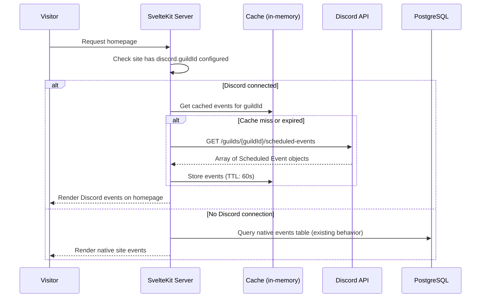

# Discord Integration Plan — Phase 6

**Status:** Phase 6a ✅ Implemented, 6b ✅ Implemented
**Phase:** 6 — Discord Integration
**Created:** 2026-06-06
**Updated:** 2026-06-06 (6a: Discord Event Display via REST API + cache; 6b: Discord Role Sync with role mapping UI)

---

## 1. Overview

The Collective Hub already uses Discord for authentication (OAuth login via Better Auth) and has an existing Discord Bot. Phase 6 leverages that bot to pull Discord Scheduled Events from a connected server and display them on the public site, replacing the native events system when a Discord connection is active.

### Sub-Features

| # | Feature | Complexity | Description | Status |
|---|---------|-----------|-------------|--------|
| 6a | Discord Event Display | Medium | Pull Scheduled Events from a Discord server via the existing bot, cache them, render on the public homepage. When connected, Discord events replace native site events. | ✅ Implemented |
| 6b | Discord Role Sync | Medium-High | Auto-assign site membership roles based on a user's Discord server roles. Requires `guilds.members.read` privileged intent on the bot. | ✅ Implemented |

### Key Design Decisions

- **Pull, not push.** Events are authored in Discord (by the community host). The site fetches and displays them. No event creation/editing from the site.
- **Replace, not merge.** When a site connects to Discord, the "Next Event" and "Upcoming Events" sections on the public homepage show Discord Scheduled Events instead of native site events. The native events admin page remains available for sites not using Discord.
- **Existing bot.** No new bot setup needed. The bot token is already in environment variables. The bot must be in the target server with permission to read Scheduled Events.
- **No iframe widget.** The official Discord widget is not used. Events are fetched server-side via REST API and rendered as native site content with the site's branding/theme.

---

## 2. Phase 6a: Discord Event Display

### 2.1 Flow



### 2.2 Settings Schema

New optional section in `siteSettings.settings` JSON:

```json
{
  "discord": {
    "guildId": null,
    "eventsEnabled": false
  }
}
```

| Field | Type | Default | Description |
|-------|------|---------|-------------|
| `discord.guildId` | `string \| null` | `null` | Discord guild/server ID to pull events from. `null` means not connected. |
| `discord.eventsEnabled` | `boolean` | `false` | Whether to show Discord events on the public homepage. Requires `guildId` to be set. |

When `eventsEnabled` is `true` AND `guildId` is not null:
- The public homepage fetches Discord events instead of querying the native `events` table
- The admin events page is hidden/replaced with a notice: "Events are managed in Discord."
- The "Next Event" and "Upcoming Schedule" sections render Discord event data

When `eventsEnabled` is `false` OR `guildId` is null:
- Existing behavior — native events table, admin events CRUD works as before

### 2.3 TypeScript Types

**File:** [`src/lib/shared/types.ts`](src/lib/shared/types.ts)

```typescript
/** Discord integration settings */
export interface DiscordSettings {
  guildId: string | null;
  eventsEnabled: boolean;
}

/** A Discord Scheduled Event, normalized for site display */
export interface DiscordEvent {
  id: string;
  guildId: string;
  name: string;
  description: string | null;
  startTime: string;       // ISO 8601
  endTime: string | null;  // ISO 8601
  status: 'SCHEDULED' | 'ACTIVE' | 'COMPLETED' | 'CANCELLED';
  entityType: 'STAGE_INSTANCE' | 'VOICE' | 'EXTERNAL';
  location: string | null;  // for EXTERNAL events
  imageUrl: string | null;  // Discord CDN URL for event cover image
  creatorId: string | null;
}
```

Add `discord?: DiscordSettings` to `SiteSettingsData`.

### 2.4 Discord REST Client

**New file:** [`src/lib/server/discord.ts`](src/lib/server/discord.ts)

Thin wrapper around the Discord REST API using native `fetch`. The existing bot token is read from `DISCORD_BOT_TOKEN` env var.

```typescript
// Key exports:
export async function getScheduledEvents(guildId: string): Promise<DiscordEvent[]>
export async function getGuild(guildId: string): Promise<{ id: string; name: string } | null>
```

**API endpoint used:** `GET /guilds/{guild.id}/scheduled-events`  
**Auth header:** `Authorization: Bot {DISCORD_BOT_TOKEN}`  
**Required bot permission:** The bot must be in the target server. No specific event permission needed to READ events (any member can see scheduled events).

**Error handling:**
- 403 (bot not in server) → return empty array, log warning
- 404 (guild not found) → return empty array
- 429 (rate limit) → retry after `Retry-After` header duration
- Network error → return empty array, log error

### 2.5 Caching Strategy

Discord's Scheduled Events API doesn't change frequently. Cache with a short TTL to avoid rate limits while staying reasonably fresh:

- **In-memory cache:** `Map<string, { events: DiscordEvent[]; fetchedAt: number }>`
- **TTL:** 60 seconds (configurable)
- **Cache key:** `guildId`
- **Invalidation:** None needed — TTL handles staleness. If an event changes in Discord, it's reflected within 60s.

No Redis or external cache needed for V1. The in-memory cache is per-deployment (each Coolify deployment caches independently), which is fine since each deployment serves one site.

### 2.6 Public Homepage Changes

**File:** [`src/routes/+page.server.ts`](src/routes/+page.server.ts)

Current behavior (lines 74–105): Queries native `events` table for next event and upcoming events, filtered by `isPublished`, `startTime > now`.

New behavior:
1. Check `siteSettings.discord.eventsEnabled` and `siteSettings.discord.guildId`
2. If both are set:
   - Call `getScheduledEvents(guildId)` (uses cache)
   - Filter to `SCHEDULED` or `ACTIVE` status events only (skip COMPLETED/CANCELLED)
   - Sort by `startTime` ascending
   - Map to `{ nextEvent, upcomingEvents }` in the same shape as native events
   - Return `eventsSource: 'discord'` so the page can optionally show a "via Discord" label
3. If not connected:
   - Query native `events` table (existing code, unchanged)
   - Return `eventsSource: 'native'`

**Important:** The return shape for events must be the same regardless of source. Both native and Discord events produce `{ id, title, description, startTime, endTime, location, externalLink, imageUrl }` — the page component doesn't care about the source.

**File:** [`src/routes/+page.svelte`](src/routes/+page.svelte)

- No structural changes needed if the return shape is normalized
- Optionally show a subtle "Events via Discord" attribution when `eventsSource === 'discord'`

### 2.7 Admin Settings Changes

**File:** [`src/routes/admin/settings/+page.server.ts`](src/routes/admin/settings/+page.server.ts)

Extend `buildMergedSettings` to handle `discordGuildId` and `discordEventsEnabled` from form data.

**File:** [`src/routes/admin/settings/+page.svelte`](src/routes/admin/settings/+page.svelte)

Add a "Discord Events" section:
- **Discord Server ID** — text input (the guild ID). Help text: "Enter your Discord server ID to pull Scheduled Events. The bot must be in your server."
- **Enable Discord Events** — checkbox. When enabled, Discord events replace native site events on the public homepage.
- **Connection status** — Shows "Bot is in server: {Server Name}" (green) or "Bot not found in server" (red) by calling `getGuild(guildId)` on load.
- Follows the existing `saveDraft` / `publish` workflow.

### 2.8 Admin Events Page Behavior

**File:** [`src/routes/admin/events/+page.server.ts`](src/routes/admin/events/+page.server.ts)

When `discord.eventsEnabled` is true AND `discord.guildId` is set:
- The load function returns `discordEventsEnabled: true` and `discordGuildId`
- The page shows: "Events are managed in Discord. [View in Discord](https://discord.com/events/{guildId})"
- Native event CRUD actions are not shown

When not connected:
- Existing behavior unchanged

**File:** [`src/routes/admin/events/+page.svelte`](src/routes/admin/events/+page.svelte)

- Add a conditional banner at top when `discordEventsEnabled` is true
- Hide the create/edit forms when Discord events are active

### 2.9 Field Mapping: Discord Event → Site Event

Discord's Scheduled Event object maps to the site's event display shape:

| Discord Field | Site Display Field | Notes |
|---------------|-------------------|-------|
| `id` | `id` | Discord's event ID (snowflake string) |
| `name` | `title` | |
| `description` | `description` | Discord returns null or markdown text |
| `scheduled_start_time` | `startTime` | ISO 8601 string, parsed to Date |
| `scheduled_end_time` | `endTime` | ISO 8601 or null |
| `entity_metadata.location` | `location` | Only for `EXTERNAL` type events |
| `status` | `status` | `SCHEDULED`/`ACTIVE` shown as live; `COMPLETED`/`CANCELLED` filtered out |
| `entity_type` | — | Used to determine icon/badge on the site |
| `image` | `imageUrl` | Discord CDN URL; null if no cover image set |
| `creator_id` | — | Not displayed on the public site |

### 2.10 Timezone Handling

Discord returns event times in ISO 8601 with the server's timezone offset. The site already has timezone conversion via [`src/lib/shared/timezone.ts`](src/lib/shared/timezone.ts). Discord events are displayed in the visitor's local timezone using the same `Intl.DateTimeFormat` approach as native events. No changes needed to the timezone utility.

### 2.11 Error States

| Scenario | Behavior |
|----------|----------|
| `DISCORD_BOT_TOKEN` not set | Log warning on startup; Discord features silently unavailable |
| Bot not in server (403) | Homepage falls back to native events; admin settings show "Bot not in server" |
| Discord API down/timeout | Homepage shows cached events if available; otherwise "No upcoming events" with no error to visitors |
| Rate limited (429) | Wait for `Retry-After`; if cache has stale data, serve it with extended TTL |
| `guildId` invalid format | Validation in settings form prevents saving; if somehow saved, API returns 404 → treated as no events |
| No events in server | Homepage hides event sections (same behavior as native with no events) |

### 2.12 File Change Summary (6a) — ✅ All changes implemented

| File | Change Type | Description |
|------|------------|-------------|
| `src/lib/server/discord.ts` | **New** ✅ | Discord REST client: `getScheduledEvents()`, `getGuild()` with in-memory cache |
| `src/lib/shared/types.ts` | Modify ✅ | Add `DiscordSettings`, `DiscordEvent` interfaces; add `discord?` to `SiteSettingsData` |
| `src/routes/+page.server.ts` | Modify ✅ | Branch: fetch Discord events when connected, native events otherwise; normalize return shape |
| `src/routes/+page.svelte` | Modify ✅ | Optional "via Discord" attribution when `eventsSource === 'discord'` |
| `src/routes/admin/settings/+page.server.ts` | Modify ✅ | Add `discordGuildId` and `discordEventsEnabled` to form merge |
| `src/routes/admin/settings/+page.svelte` | Modify ✅ | Add Discord Events section with guild ID input, enable toggle, connection status |
| `src/routes/admin/events/+page.server.ts` | Modify ✅ | Detect Discord mode; return `discordEventsEnabled` flag |
| `src/routes/admin/events/+page.svelte` | Modify ✅ | Show Discord-managed banner when events come from Discord; hide native CRUD |

**No schema changes. No migrations. No new env vars** (bot token already exists).

---

## 3. Phase 6b: Discord Role Sync (Optional Follow-Up)

### 3.1 Overview

When a user logs in via Discord OAuth, the system checks their roles in the connected Discord server and automatically assigns or updates their site membership role. This makes the Discord server's role hierarchy the source of truth for site access.

### 3.2 Prerequisites

- Discord Bot with `guilds.members.read` privileged intent enabled
- Bot must be in the target server
- Role mapping configured in site settings

### 3.3 Settings Schema

Extends the `discord` settings section from 6a:

```json
{
  "discord": {
    "guildId": "123456789012345678",
    "eventsEnabled": true,
    "roleSyncEnabled": false,
    "roleMappings": [
      { "discordRoleId": "111111111111111111", "siteRole": "owner" },
      { "discordRoleId": "222222222222222222", "siteRole": "admin" },
      { "discordRoleId": "333333333333333333", "siteRole": "editor" }
    ]
  }
}
```

### 3.4 How It Works

On every login (in [`src/routes/+layout.server.ts`](src/routes/+layout.server.ts)), after existing auth logic:

1. Check `discord.roleSyncEnabled` and `discord.guildId`
2. If both set, call `GET /guilds/{guildId}/members/{userId}` via the bot
3. Compare the member's `roles` array against `roleMappings`
4. If a mapping matches, upsert a membership row with the mapped role
5. If no mapping matches and the user has a membership from a previous sync, remove/downgrade it
6. Owner bootstrap (`OWNER_DISCORD_ID`) always takes precedence — role sync never downgrades the bootstrapped owner
7. Super admin flag is never affected by role sync

### 3.5 File Changes (6b)

| File | Change Type | Description |
|------|------------|-------------|
| `src/lib/server/discord.ts` | Modify | Add `getGuildMember(guildId, userId)` and `getGuildRoles(guildId)` |
| `src/routes/+layout.server.ts` | Modify | Add role sync check after existing auth/owner bootstrap |
| `src/routes/admin/settings/+page.server.ts` | Modify | Add role mapping form fields |
| `src/routes/admin/settings/+page.svelte` | Modify | Add role sync toggle and mapping table |
| `src/routes/api/discord/roles/+server.ts` | **New** | Proxy endpoint to fetch guild roles for the mapping dropdown |

**No schema changes.** No migrations.

### 3.6 Edge Cases

| Scenario | Behavior |
|----------|----------|
| User not in Discord server | Skip role sync; existing memberships unchanged |
| Bot lacks `guilds.members.read` intent | Discord API returns 403; log warning; skip role sync |
| Multiple role mappings match | Highest-priority role wins (owner > admin > editor) |
| Owner via bootstrap | Role sync never downgrades an `OWNER_DISCORD_ID` match |
| Super admin | Always keeps super admin status; role sync doesn't affect it |

---

## 4. Shared Infrastructure

### 4.1 Discord Bot

The existing bot is used for all Phase 6 features. The bot token is read from `DISCORD_BOT_TOKEN` env var. The bot must be in any server whose events are displayed.

**Required permissions for 6a:** None beyond being in the server (any server member can list scheduled events).  
**Required permissions for 6b:** `guilds.members.read` privileged intent (must be enabled in Discord Developer Portal).

### 4.2 No New Dependencies

All Discord API calls use native `fetch`. The existing `@discordjs/rest` or similar is not needed — a thin wrapper in [`src/lib/server/discord.ts`](src/lib/server/discord.ts) is sufficient.

### 4.3 Environment Variables

All already exist. No new env vars needed for Phase 6:

| Variable | Used By | Status |
|----------|---------|--------|
| `DISCORD_BOT_TOKEN` | `discord.ts` REST client | Already exists |
| `DISCORD_CLIENT_ID` | OAuth login (existing) | Already exists |
| `DISCORD_CLIENT_SECRET` | OAuth login (existing) | Already exists |

---

## 5. Security Considerations

| Concern | Mitigation |
|---------|-----------|
| Bot token exposure | `DISCORD_BOT_TOKEN` is server-side only (env var, never exposed to client) |
| Unauthorized guild access | Site owner must explicitly configure `guildId` in admin settings; the bot must already be in that server |
| Event data leakage | Only `SCHEDULED` and `ACTIVE` events are exposed publicly; `COMPLETED` and `CANCELLED` are filtered out |
| Guild member data (6b) | Requires `guilds.members.read` privileged intent; Discord requires justification to enable |
| Cache poisoning | Cache is server-side in-memory only; keys are guild IDs from trusted site settings |
| Rate limiting | Cache reduces API calls to 1 per 60s per guild; well within Discord's 50 req/s global limit |

---

## 6. Architecture Diagram

```mermaid
flowchart TD
    subgraph Public Site
        HP[Homepage +page.svelte]
    end

    subgraph Admin
        AS[Admin Settings - Discord Config]
        AE[Admin Events - Shows status]
    end

    subgraph Server
        PL[+page.server.ts - Load Events]
        DC[lib/server/discord.ts - REST Client + Cache]
    end

    subgraph Discord
        DA[Discord API - Scheduled Events]
    end

    subgraph Database
        SS[siteSettings - discord JSON]
        EV[events - native table, unused when Discord connected]
    end

    HP -->|events data| PL
    PL -->|discord connected?| SS
    PL -->|yes: fetch events| DC
    PL -->|no: query native| EV
    DC -->|GET /guilds/{id}/scheduled-events| DA
    DC -->|cache hit: return cached| DC
    AS -->|save guildId + toggle| SS
    AE -->|reads| SS
```

---

## 7. Migration & Deployment Plan

### Steps 1–3: ✅ Deployed (6a Complete)

Steps 1–3 (Discord REST client + types, admin settings UI, public homepage changes) have been implemented. See [Section 2.12](#212-file-change-summary-6a--all-changes-implemented) for the completed file list.

### Step 4 (Optional): ❌ Deploy Role Sync (6b) — Not Yet Implemented

- Add role mapping UI to admin settings
- Add role sync logic to `+layout.server.ts`
- Deploy `/api/discord/roles` proxy endpoint

### Rollback

- Set `discord.eventsEnabled` to `false` in site settings → instantly back to native events
- Remove `discord.guildId` → Discord client never called
- Each step is independently reversible

---

## 8. Open Questions

1. **Cache TTL:** Is 60 seconds appropriate? Discord Scheduled Events don't change frequently. Could be increased to 5 minutes.

2. **Event image handling:** Discord returns a CDN URL for the event cover image. Should the site proxy/rehost it, or link directly to Discord's CDN? Direct linking is simpler and Discord's CDN is reliable.

3. **"View in Discord" link:** Should each event card include a link to the Discord event (e.g., `https://discord.com/events/{guildId}/{eventId}`)? This lets visitors RSVP/interact in Discord where the event actually lives.

4. **Role sync (6b):** Do you still want role sync, or is event display sufficient for Phase 6? Role sync adds complexity with the `guilds.members.read` privileged intent requirement.

5. **Feature flag:** Should Discord events be gated by a `discordEvents` feature flag (following the existing pattern in [`FeatureFlags`](src/lib/shared/types.ts:44)), or is the per-site `eventsEnabled` toggle sufficient?
